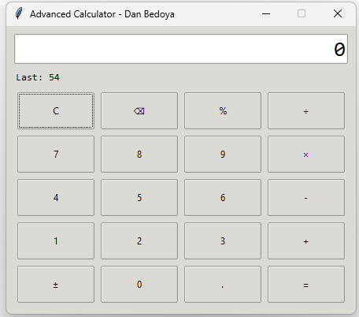

Advanced Calculator - Dan Bedoya

A modern and user-friendly calculator built with Python and Tkinter.
This project is part of my Python learning path — improving GUI design, input validation, and event handling.

- Features

- Interactive GUI using Tkinter

+ - x ÷ Basic arithmetic operations

- Percentage and sign toggle (±) support

- Error handling for invalid or malformed expressions

- Keyboard shortcuts for smooth user experience

- Technical Details

Developed in Python 3.13

GUI framework: Tkinter (ttk theme: Clam)

Custom safe evaluator to prevent code injection

Replaces “×” and “÷” symbols for correct mathematical processing

**How to Run**

Clone the repository:

git clone https://github.com/dazabe96/Advanced-Calculator-DanBedoya.git
cd Advanced-Calculator-DanBedoya

Run the project:

py advanced_calculator_DanBedoya.py

Enjoy the calculator! 

 

**Author**

Dan Bedoya
📍 Saint John, New Brunswick, Canada
📧 dazabe.96@gmail.com

🔗 LinkedIn
